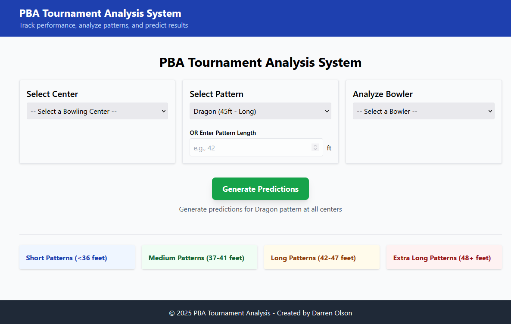
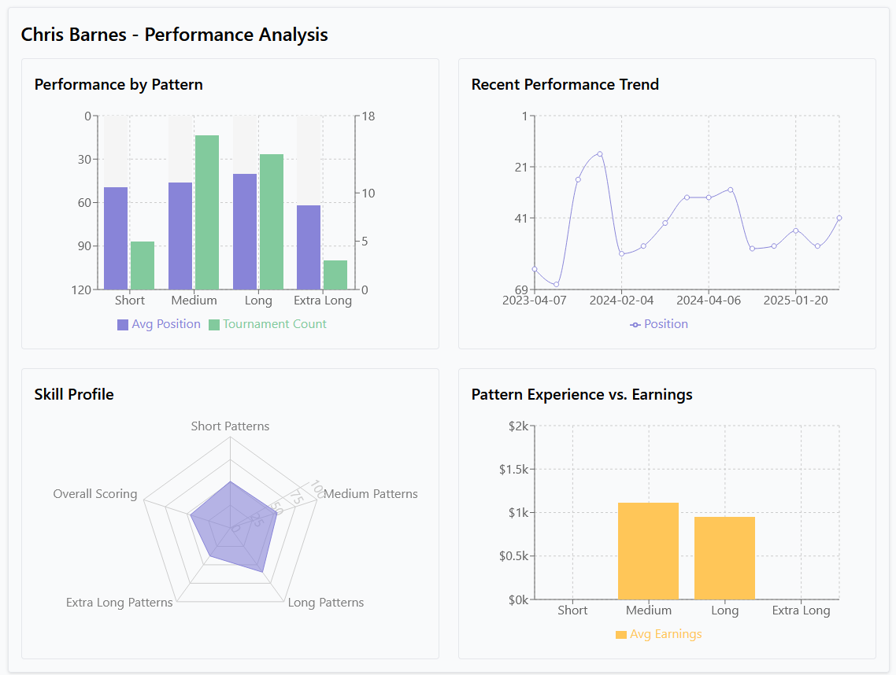
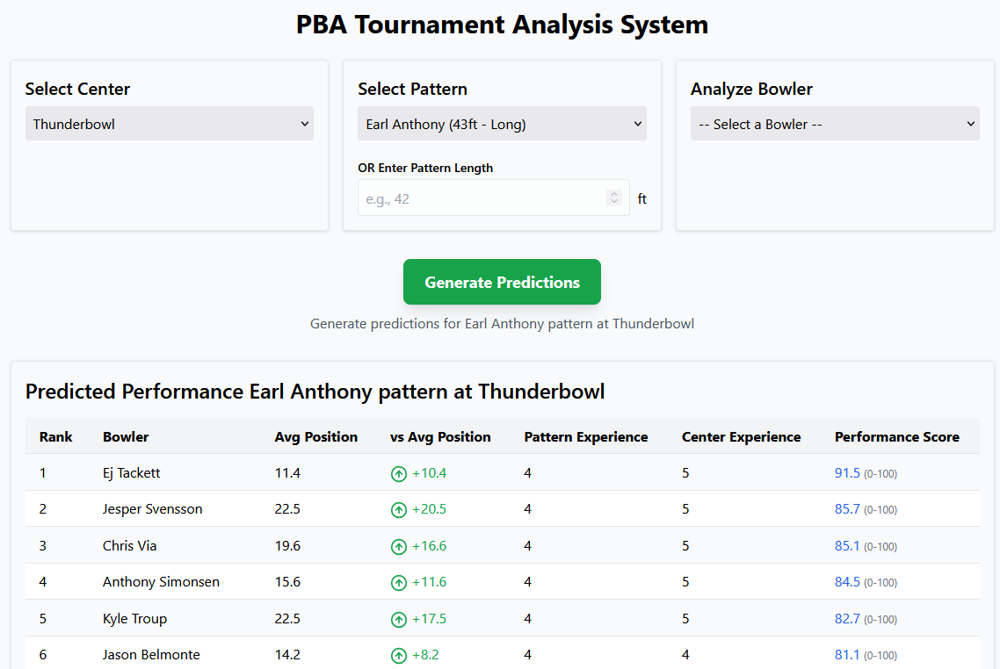

# PBA Tournament Analysis System

A data analysis and visualization tool for professional bowling tournament data. This system analyzes tournament results from the Professional Bowlers Association (PBA) to provide insights into bowler performance across different oil patterns and bowling centers.


*Screenshot: Main dashboard with tournament predictions and pattern visualization*

## Project Overview

This application integrates web scraping, data analysis, and interactive visualization to help predict and analyze performance in professional bowling tournaments. The system examines historical performance data across different oil patterns and venues to generate predictions and provide detailed performance analytics.

## Features

- **Data Collection**: Scrapes tournament results from the PBA website
- **Oil Pattern Visualization**: Interactive visual representation of lane oil patterns
- **Performance Analysis**: Analyzes bowler performance across different pattern types and bowling centers
- **Tournament Prediction**: Uses a multi-factor analysis to predict tournament outcomes
- **Bowler Stats**: Detailed performance metrics for individual bowlers
- **Interactive Dashboard**: React-based frontend for exploring data and predictions

## Screenshots

### Bowler Performance Analysis

*Screenshot: Detailed bowler performance metrics across different pattern types*

### Tournament Predictions

*Screenshot: Tournament prediction results based on pattern and center selection*

## Installation

### Prerequisites
- Python 3.8+
- Node.js 14+
- npm or yarn

### Backend Setup
1. Clone the repository
   ```
   git clone https://github.com/DarrenJOlson/pba-analysis-app.git
   cd pba-analysis-app
   ```

2. Create and activate a virtual environment
   ```
   python -m venv venv
   source venv/bin/activate  # On Windows: venv\Scripts\activate
   ```

3. Install Python dependencies
   ```
   pip install -r backend/requirements.txt
   ```

4. Start the Flask API server
   ```
   python backend/data_pipeline.py
   ```

### Frontend Setup
1. Navigate to the frontend directory
   ```
   cd frontend
   ```

2. Install dependencies
   ```
   npm install
   ```

3. Start the development server
   ```
   npm start
   ```

4. Open your browser and go to `http://localhost:3000`

## Usage

### Data Collection
To scrape the latest PBA tournament data:
```
python backend/run_scraper.py [YEAR]
```
Where `[YEAR]` is optional and defaults to the current year.

### Generating Predictions
1. Select a bowling center from the dropdown
2. Select an oil pattern from the dropdown
3. Click the "Generate Predictions" button to see predicted bowler performance

### Analyzing Individual Bowlers
1. Select a bowler from the dropdown
2. View their performance metrics across different pattern types
3. Examine their recent tournament results and performance trends
4. Analyze their skill profile via the radar chart

## Project Structure

```
pba-analysis-app/
├── backend/               # Python backend
│   ├── data/              # CSV and JSON data files
│   ├── pba_scraper.py     # Web scraper for PBA tournament data
│   ├── pattern_analyzer.py # Analysis engine for bowler performance
│   ├── data_pipeline.py   # Flask API for serving data to frontend
│   └── run_scraper.py     # Command-line interface for scraper
├── frontend/              # React frontend
│   ├── public/            # Static assets
│   ├── src/               # React source code
│   │   ├── components/    # React components
│   │   ├── services/      # API services
│   │   └── ...            # Other React app files
```

## Technologies Used

### Backend
- **Python** - Core programming language
- **Flask** - Web API framework
- **Pandas** - Data analysis and manipulation
- **Beautiful Soup** - Web scraping
- **Matplotlib/Seaborn** - Data visualization

### Frontend
- **React** - UI framework
- **TypeScript** - Type-safe JavaScript
- **Recharts** - Interactive charts and data visualization
- **Tailwind CSS** - Styling and UI components
- **Axios** - API requests

## License and Usage

This project is shared as a portfolio piece for educational and demonstration purposes only. The code is provided under a Creative Commons Attribution-NonCommercial license, which prohibits using this work for commercial purposes.

This project is NOT open-source software. All rights are reserved except those expressly granted in the license.

## Acknowledgments

- This project was developed with guidance and code assistance from Claude AI
- PBA for the tournament data and pattern information
- The open-source community for the tools and libraries used in this project

---

*Note: This project is intended as a portfolio piece to demonstrate coding and data analysis skills.*
